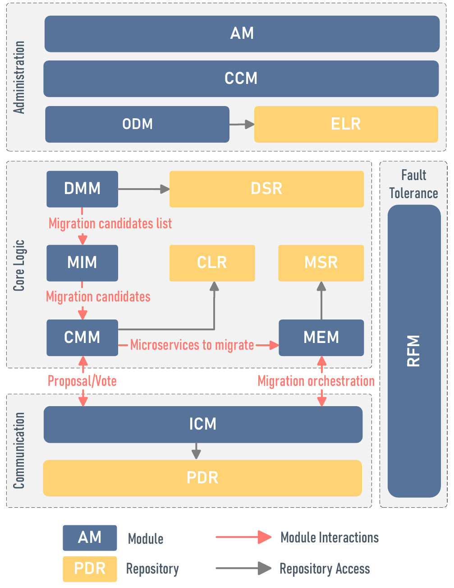
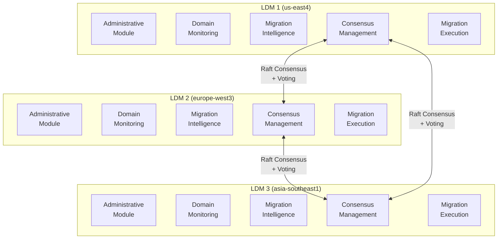
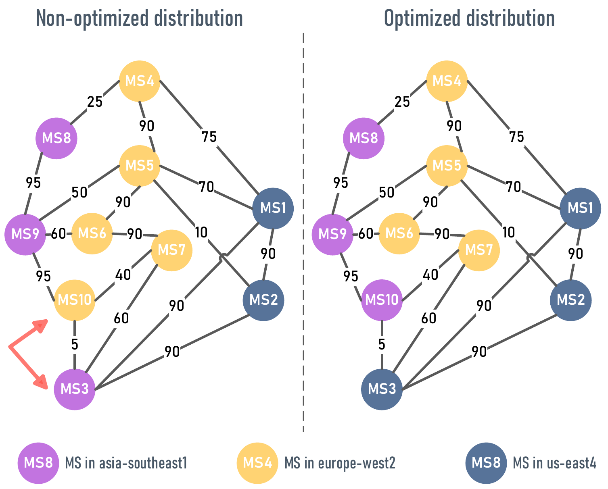
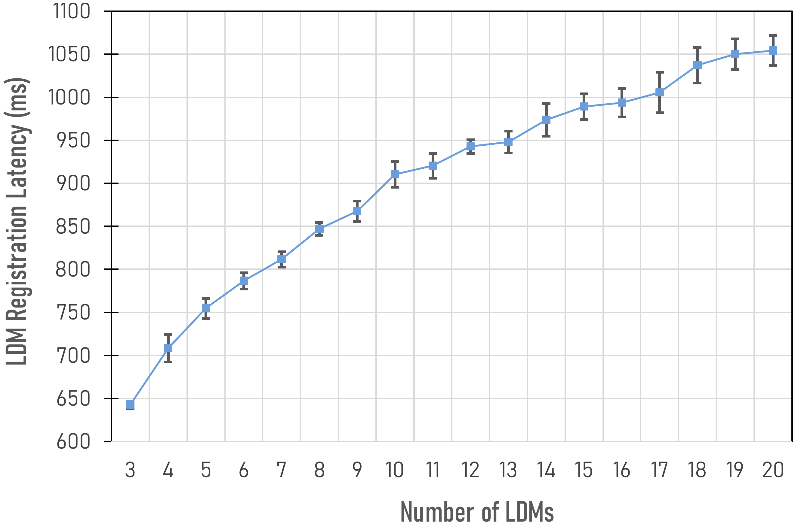
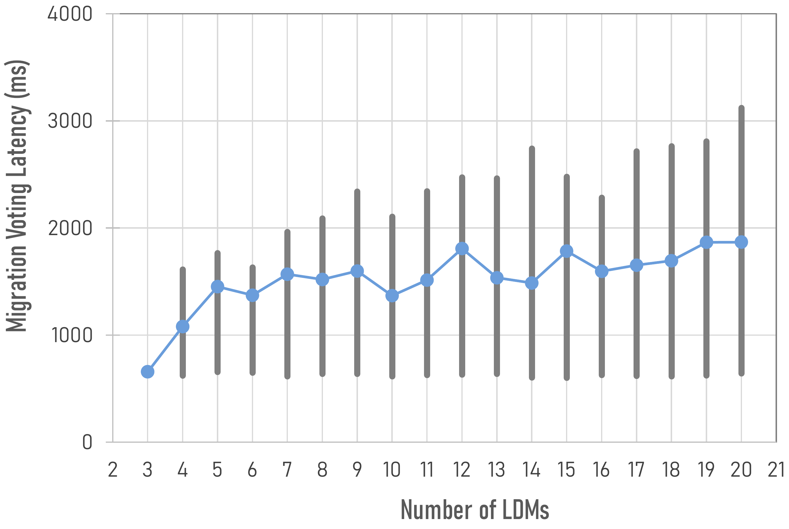

# DREAMS

**Decentralized Resource Allocation and Service Management across the Compute Continuum Using Service Affinity**

[](https://openjdk.org)
[](https://quarkus.io)
[](https://kubernetes.io)
[](https://ieeexplore.ieee.org/document/11250481/)

DREAMS is a decentralized framework that optimizes microservice placement decisions collaboratively across distributed computational domains. Each domain is managed by an autonomous **Local Domain Manager (LDM)** that coordinates with peers through a Raft-based consensus algorithm and cost-benefit voting to achieve globally optimized service placements with high fault tolerance.

**Paper:** [DREAMS: Decentralized Resource Allocation and Service Management across the Compute Continuum Using Service Affinity](https://ieeexplore.ieee.org/document/11250481/) (IEEE ISNCC 2025)

## Research Context

Modern manufacturing systems require adaptive computing infrastructures that respond to dynamic workloads across the compute continuum. Traditional centralized placement solutions struggle to scale, suffer from latency bottlenecks, and introduce single points of failure. DREAMS addresses this through decentralized, privacy-preserving coordination using **Service Affinity** -- a multi-dimensional metric capturing runtime communication, design-time dependencies, operational patterns, and data privacy constraints.

### Key Contributions

1. A **decentralized decision-making framework** for collaborative resource allocation and service management across the compute continuum.
2. The design and implementation of a reusable **Local Domain Manager (LDM)**, capable of autonomous operation and coordination through consensus mechanisms.
3. An extensive evaluation demonstrating feasibility and **sub-linear scalability** as the number of domains increases.

## Architecture

Each LDM operates autonomously within its domain while coordinating globally through Raft consensus and a two-phase migration protocol.





### LDM Modules

| Module | Abbreviation | Responsibility |
|:-------|:-------------|:---------------|
| **Administrative** | AM | Dashboard, policy management, visualization |
| **Configuration Control** | CCM | Configuration repository, dynamic updates, validation |
| **Observability & Diagnostics** | ODM | Metrics aggregation, event logging |
| **Domain Monitoring** | DMM | Service Health Monitor, Service Affinity Calculator |
| **Migration Intelligence** | MIM | Migration Eligibility Evaluator (leader), Cost-Benefit Analyzer (follower) |
| **Consensus Management** | CMM | Proposal Manager, Voting Engine, Leader Coordinator, Fault Recovery |
| **Migration Execution** | MEM | Migration Orchestrator, Rollback Manager, Health Validator |
| **Inter-Domain Communication** | ICM | LDM Discovery, Inter-domain Migration Coordinator |

### Repositories

| Repository | Description |
|:-----------|:------------|
| **Event Log (ELR)** | System health metrics, migration events, error traces |
| **Domain State (DSR)** | Intra-domain affinity scores, topology, resource availability |
| **Consensus Log (CLR)** | Raft messages, committed proposals, leader election history |
| **Migration State (MSR)** | Ongoing/completed migrations, checkpoints, rollback support |
| **Peer Domain (PDR)** | Peer health, inter-domain latency, membership |

## Service Affinity

Service Affinity captures four dimensions of microservice relationships to quantify placement quality:

- **Runtime communication** -- message frequency and data exchange volume between services
- **Design-time dependencies** -- architectural coupling in the service dependency graph
- **Operational patterns** -- shared deployment lifecycle, co-scaling behavior
- **Data privacy constraints** -- compliance zones and data classification requirements

### QoS Improvement Score

For a microservice *m* currently in cluster *c_current*, the QoS improvement score is:

```
Q = A_inter - A_intra - L
```

where:
- **A_intra** = affinity of *m* to services in its current cluster
- **A_inter** = max affinity of *m* to any other cluster
- **L** = latency penalty (sigmoid-scaled by affinity gain)

Migration is proposed when `Q > θ_proposal`.

## Two-Phase Migration Protocol

### Phase 1 -- Candidate Selection (Leader LDM)

1. Filter non-migratable microservices and those already optimally placed
2. Compute cluster affinity scores across all clusters
3. Calculate affinity gain: `ΔA = A_inter - A_intra`
4. Apply latency penalty with sigmoid scaling (controlled by `γ_proposal`)
5. Select the candidate with the highest QoS improvement score `Q`
6. If `Q > θ_proposal`, broadcast migration proposal to all LDMs

### Phase 2 -- Voting (All LDMs)

Each LDM independently evaluates the proposal:

1. Compute local impact score from connected microservices
2. If no local impact (`I_local = 0`), cast positive vote immediately
3. Normalize impact and compute latency difference to target cluster
4. Calculate affinity penalty weight (sigmoid-scaled by `γ_vote`)
5. If scaled latency penalty `< θ_vote`, cast positive vote; otherwise, negative

Consensus is reached via Raft quorum (majority vote). The theoretical complexity of the voting procedure is **O(1)** -- all LDMs evaluate independently in parallel.

### Tunable Parameters

| Parameter | Symbol | Role |
|:----------|:-------|:-----|
| Affinity Gain Sensitivity | `γ_proposal` | Smaller = conservative; larger = aggressive migrations |
| Proposal Threshold | `θ_proposal` | Minimum net benefit to propose migration |
| Local Impact Sensitivity | `γ_vote` | Smaller = favors local stability; larger = global cooperation |
| Voting Threshold | `θ_vote` | Maximum acceptable latency penalty for positive vote |

## Design Principles

1. **Self-governed Decentralization** -- Each LDM operates autonomously; no central controller
2. **Privacy-Preserving Computation** -- Domains share only aggregated metrics, not raw data
3. **Collaborative Optimization** -- Global optimality through local decisions and consensus
4. **Heuristic-Driven Placement** -- Affinity-based cost-benefit analysis with sigmoid scaling
5. **Fault Tolerance** -- Raft consensus tolerates ⌊(N-1)/2⌋ node failures

## Evaluation Results

Evaluated on 3 LDM clusters deployed across Google Cloud regions (`us-east4`, `europe-west3`, `asia-southeast1`) on `e2-standard-4` VMs (4 vCPUs, 16 GB RAM, Ubuntu 22.04). Cluster sizes tested from 3 to 20 LDMs.

### Optimization Correctness



| Metric | Value |
|:-------|:------|
| Initial inter-domain affinity | 630 |
| Globally optimal solution | 395 |
| Required migrations | MS3 → us-east4, MS10 → asia-southeast1 |
| **Result** | **Converged to optimal state** |

Under fault tolerance testing, the system correctly recovered after leader failure via Raft election and resumed optimization without manual intervention.

### LDM Registration Latency



| Cluster Size | Mean Registration | Trend |
|:-------------|:-----------------|:------|
| 3 nodes | 556 ms | Baseline |
| 10 nodes | ~1,500 ms | Sub-linear |
| 20 nodes | 3,121 ms | Sub-linear |

Best-case (seed nodes): average 623.9 ms, stable across all configurations. **Registration scales sub-linearly** with the number of LDMs.

### Migration Voting Latency



| Cluster Size | Mean Voting Time | Std Dev |
|:-------------|:----------------|:--------|
| 3 nodes | 642.80 ms | Low |
| 10 nodes | ~850 ms | Low |
| 20 nodes | 1,054.10 ms | Low |

**Sub-linear growth with low variance** -- voting remains predictable and stable as the cluster scales. The sub-linear trend is caused by second-order effects (minor leader workload increase, median node latency).

## Tech Stack

| Component | Technology |
|:----------|:-----------|
| Language | Java 17 |
| Framework | [Quarkus](https://quarkus.io/) with GraalVM |
| Consensus | [Apache Ratis](https://ratis.apache.org/) (Raft) |
| Clustering & Event Sourcing | [Apache Pekko](https://pekko.apache.org/) (Protobuf serialization) |
| Caching | [Caffeine](https://github.com/ben-manes/caffeine) |
| Database | PostgreSQL with Liquibase migrations |
| Architecture | Hexagonal (Ports & Adapters), Domain-Driven Design |
| Frontend | [Next.js 15](https://nextjs.org/) + [Cytoscape.js](https://js.cytoscape.org/) |
| Deployment | Docker, Kubernetes (GKE) |

## Getting Started

### Prerequisites

- Java 17+
- Docker & Docker Compose
- PostgreSQL 17+ (or use the provided docker-compose)

### Running with Docker Compose

```bash
# Clone the repository
git clone https://github.com/haidinhtuan/DREAMS.git
cd DREAMS

# Start a 3-node LDM cluster with PostgreSQL
docker compose up -d

# Monitor logs
docker compose logs -f ldm1 ldm2 ldm3
```

The first LDM (`ldm1`) initializes the database schema via Liquibase. Other LDMs must have `LIQUIBASE_MIGRATE_AT_START=false`.

### Running from IDE

Add the following to your `hosts` file:
```
127.0.0.1 host.docker.internal
127.0.0.1 ldm1
127.0.0.1 ldm2
127.0.0.1 ldm3
```

Then run with:
```bash
./gradlew quarkusDev
```

### Building

```bash
# Build the application
./gradlew build

# Build Docker image via JIB
./gradlew clean build -Dquarkus.container-image.build=true -Dquarkus.container-image.push=false

# Build native executable (requires GraalVM)
./gradlew build -Dquarkus.native.enabled=true
```

### Compiling Protobuf Files

```bash
protoc -I=src/main/proto/com/ldm/infrastructure/serialization \
  --java_out=src/main/java \
  src/main/proto/com/ldm/infrastructure/serialization/migration_action.proto \
  src/main/proto/com/ldm/infrastructure/serialization/ping_pong.proto \
  src/main/proto/com/ldm/infrastructure/serialization/evaluate_migration_proposal.proto
```

### Dashboard

Access the React dashboard for real-time microservice graph visualization and migration statistics:
```
http://localhost:3000/graph
```
The frontend connects via WebSocket to the LDM backend (e.g., `ws://localhost:8080/dashboard`).

## REST APIs

| Endpoint | Description |
|:---------|:------------|
| `GET /api/migrations` | Read migration actions from Raft storage |
| `POST /api/ratis/trigger-leader-change/{peerId}` | Trigger leadership change (must be called on current leader) |

## Project Structure

```
DREAMS/
├── src/main/java/com/ldm/
│   ├── application/                 # Use cases and application services
│   │   ├── port/                   # Port interfaces
│   │   └── service/                # DomainManager, caches, state services
│   ├── domain/                      # Domain models and business logic
│   │   ├── model/                  # Microservice, K8sCluster, MigrationAction
│   │   └── service/                # Affinity calculation, QoS optimization
│   ├── infrastructure/              # Technical adapters
│   │   ├── adapter/in/
│   │   │   ├── pekko/             # Cluster actors, migration voters
│   │   │   ├── ratis/             # Raft state machine, leader election
│   │   │   ├── rest/              # REST API endpoints
│   │   │   ├── websocket/         # Dashboard WebSocket
│   │   │   └── projection/        # Event projections
│   │   ├── adapter/out/            # Output adapters
│   │   ├── config/                 # CDI configuration
│   │   ├── serialization/          # Protobuf serializers
│   │   └── mapper/                 # MapStruct mappers
│   └── shared/                      # Constants and utilities
├── src/main/proto/                  # Protobuf definitions
├── src/main/resources/
│   ├── application.yaml             # Quarkus + LDM configuration
│   ├── application.conf             # Apache Pekko configuration
│   └── db/changelog/               # Liquibase migrations
├── frontend/ldm-frontend/           # Next.js dashboard
│   ├── app/dashboard/              # Dashboard page (WebSocket consumer)
│   └── app/components/Graph.tsx    # Cytoscape.js graph visualization
├── experiments/
│   ├── exp1/ -- exp5/              # Test scenarios with JSON topology files
├── docker-compose.yml               # 3-node LDM cluster
├── docker-compose-exp.yml           # 6-node experimental cluster
└── build.gradle                     # Gradle build configuration
```

## Experiments

| # | Description | Expected Result |
|:--|:------------|:----------------|
| **Exp 1** | All clusters already optimal | No migration |
| **Exp 2** | MS3 misplaced in Berlin | MS3 migrates to New York (highest affinity) |
| **Exp 3** | MS10 misplaced in Singapore | MS10 migrates to Berlin (highest affinity) |
| **Exp 4** | MS3 and MS10 both misplaced | Both migrate to highest-affinity clusters |
| **Exp 5** | 6 LDMs, 20 microservices | E2E QoS optimization across 6 domains |

Select experiment data by updating the volume mounts in `docker-compose.yml`:
```yaml
volumes:
  - ./experiments/exp4/LDM1.json:/data/LDM1.json
```

Set `LEADER_ELECTION_MODE=DEFAULT` for realistic Raft-based leader election, or `TESTING` for fixed leader (faster iteration).

## Publications

DREAMS builds on a series of prior work on service affinity and microservice management:

1. **H. Dinh-Tuan, T. H. Nguyen, and S. R. Pandey**, "DREAMS: Decentralized Resource Allocation and Service Management across the Compute Continuum Using Service Affinity," *IEEE ISNCC*, 2025. [[IEEE]](https://ieeexplore.ieee.org/document/11250481/)

2. **H. Dinh-Tuan and J. Six**, "SAGA: A Service Affinity Graph-based Approach for Optimized Microservice Placement across the Compute Continuum," *IEEE SmartNets*, 2024. [[IEEE]](https://doi.org/10.1109/SmartNets61466.2024.10577726)

3. **H. Dinh-Tuan and F. Beierle**, "MS2M: A Message-Based Approach for Live Stateful Microservices Migration," *IEEE CIoT*, 2022. [[IEEE]](https://doi.org/10.1109/CIoT53061.2022.9766542)

4. **H. Dinh-Tuan, N. Mora-Acedo, and M. Jarke**, "Self-Optimizing Microservices: An Automated Tuning Approach via Runtime Search," *IEEE CIoT*, 2022. [[IEEE]](https://doi.org/10.1109/CIoT53061.2022.9751522)

## License

This project is developed for academic research purposes at Technische Universitat Berlin.
